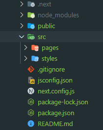
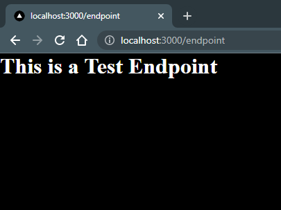

<h1>Next.js Restaurant</h1>

<h2><b>Introduction / Overview </b></h2>

<ul>
<li>To fork the project &rArr; <a href="">Github Repo</a></li>

> <b><i>!!!</i></b> Install dependencies before running the application

<li>To create this project from scratch, follow along <a href="">here</a></li>
</ul>

<br/>

<p>In the words of <a href="https://nextjs.org/">Vercel</a>, <b><i>"Used by some of the world's largest companies, Next.js enables you to create full-stack web applications by extending the latest React features, and integrating powerful Rust-based JavaScript tooling for the fastest builds."</i></b>

<br/>

When creating a Next.js app automatically through <b><i>npx create-next-app</i></b>, it comes pre-packaged with these dependencies:

<ul>
  <li><b>next</b></li>
  <li><b>react</b></li>
  <li><b>reac-dom</b></li>
</ul>

It's important to note these dependencies because Next.js offers built-in <b><a href="https://reactjs.org/">React</a></b> features that are extremely useful and convenient for building quick and easy full-stack web applications.

<br/>

If you have experience with <b><i>React</i></b>, you're probably familiar with all the steps required to import routing functionality. For example, you'd have to:

<ul>
  <li>Install the <b><i>react-router</i></b> and <b><i>react-router-dom</i></b> dependencies</li>

```sh
npm install react-router react-router-dom
```

  <li>Import the elements</li>
  <ul>
    <li>In <b><i>index.js</i></b></li>

```jsx
import { BrowserRouter } from "react-router-dom";

<React.StrictMode>
  <BrowserRouter>
    <App />
  </BrowserRouter>
</React.StrictMode>;
```

  <li>In <b><i>app.js</i></b></li>

```js
import { Link, Route, Routes } from "react-router-dom";
```

  </ul>
  <li>Specify routes and endpoints</li>

```jsx
import { Link, Route, Routes } from "react-router-dom";


<nav>
<ul>
  <li>
    <Link to="/">Home</Link>
  </li>
</ul>
</nav>

<Routes>
  <Route path="/" element={<HomeComponent />} />
</Routes>
```

</ul>

<br/>

Next.js's built-in alternative to routing is called <b><i>pages</i></b>. Check out the file structure (created with <b><i>npx create-next-app</i></b>):



<br/>

If you were to create an <b><i>endpoint.js</i></b> file within the <b><i>pages</i></b> directory and populated it with something like this:

```js
export default function Endpoint() {
  return <h1>This is a Test Endpoint</h1>;
}
```

<br/>

You'd be able to access that endpoint by running <b><i>npm run dev</i></b> and navigating to <b><i>localhost:3000/endpoint</i></b>. If everything is working correctly, you should be able to see the code printed out in your browser.


</p>

<br/>

<h2><b>Other Features</b></h2>

<p>In addition to routing, some other features implemented into this application include:

<ul>
  <li>Links between pages, asset storage, and creating a page header to be displayed in the browser tab</li>
  <li>Local and Global level CSS</li>
  <li>Shared context between components</li>
  <li>Images</li>
</ul>

<br/>
